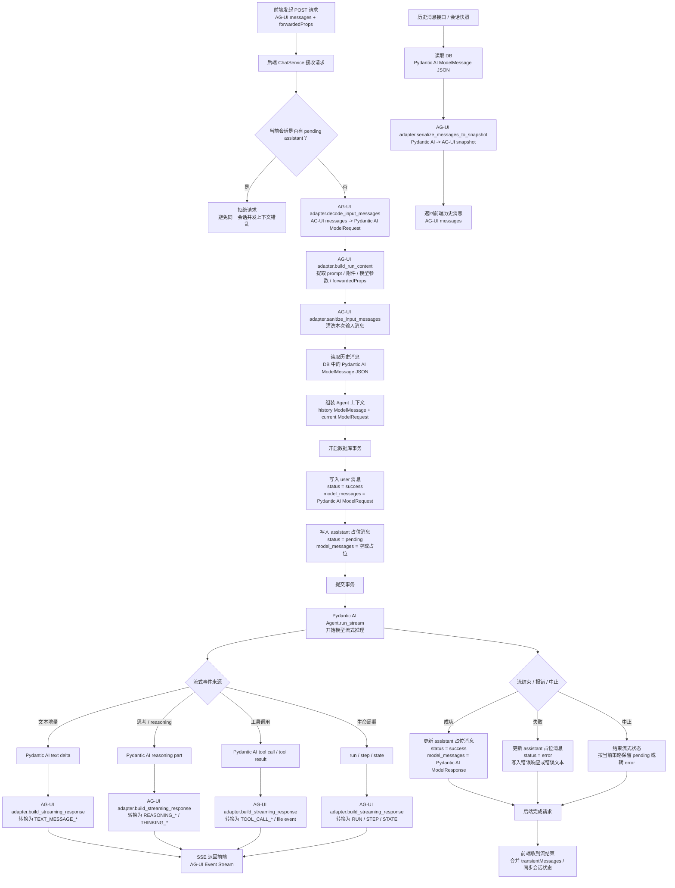

# AI

为系统提供 AI 赋能

- 基于 AG-UI 的流式生成能力，支持文本与图片生成
- 支持对话列表、详情、重命名、置顶、删除，以及上下文清理
- 支持消息编辑保存、删除、清空，以及基于用户消息或 AI 回复重生成
- 支持默认模型、快捷短语、供应商、模型、MCP 管理，以及批量同步供应商模型
- 支持 MCP、联网搜索、思考参数、图片生成参数、内置工具能力透传，并适配多种供应商类型

## 插件类型

- 应用级插件

## 配置说明

插件目录下 `plugin.toml` 的 `[settings]` 中包含以下内容：

```toml
[settings]
AI_CODE_MODE_TOOLS = []
AI_CODE_MODE_MAX_RETRIES = 3
AI_CODE_MODE_DYNAMIC_CATALOG = false
AI_HTTP_MAX_RETRIES = 5
AI_MCP_MAX_RETRIES = 1
```

当前项目的 `backend/core/conf.py` 已包含以下字段：

```python
##################################################
# [ Plugin ] ai
##################################################
AI_CONFIG_STATUS: bool = True
AI_EXA_API_KEY: str | None = None
AI_TAVILY_API_KEY: str | None = None

# 基础配置（in plugin.toml）
AI_CODE_MODE_TOOLS: list[str]
AI_CODE_MODE_MAX_RETRIES: int
AI_CODE_MODE_DYNAMIC_CATALOG: bool
AI_HTTP_MAX_RETRIES: int
AI_MCP_MAX_RETRIES: int
```

## 使用方式

1. 安装并启用参数配置插件和 AI 插件后，重启后端服务
2. 通过 AI 配置管理菜单维护 `AI_EXA_API_KEY` 和 `AI_TAVILY_API_KEY`
3. 先创建 AI 供应商，再同步或创建对应模型
4. 配置默认助手模型
5. 配置 MCP 和快捷短语等辅助能力，其中 OpenRouter 模型 ID 需使用 `供应商/模型` 格式
6. 发起对话并维护会话历史

## 后端对话流程

后端对话接口以 AG-UI 作为外部协议，以 Pydantic AI `ModelMessage` 作为内部消息与存储格式。AG-UI 主要在请求入口、流式事件输出、历史快照输出三个位置介入。



## 卸载说明

- 卸载插件后，建议同步移除参数配置中的 AI 相关配置和 `backend/core/conf.py` 中的插件配置
- 如前端页面或业务流程已依赖 AI 对话、默认模型、模型、供应商、MCP 等能力，请同步清理对应集成

## 联系方式

- 作者：`wu-clan`
- 反馈方式：提交 Issue 或 PR
